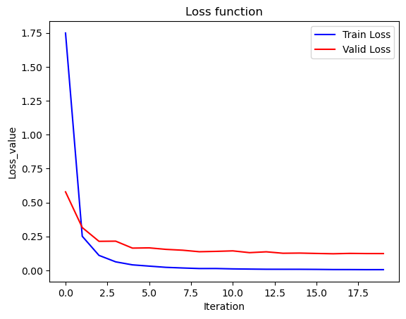

# Use-ResNet-to-train-Flower102-Dataset
I'm a starter of AI. This is my first personal project.
In this project, I use the pre-trained ResNet Model to do the classification of VGG Flower102 dataset
Here are the preview of the data:(102 kinds of flowers)

And this is the the ResNet18 framework I used, which comes from Dr.He Kaiming.

What's more, this is the 20 epochs training and validing loss curve:

